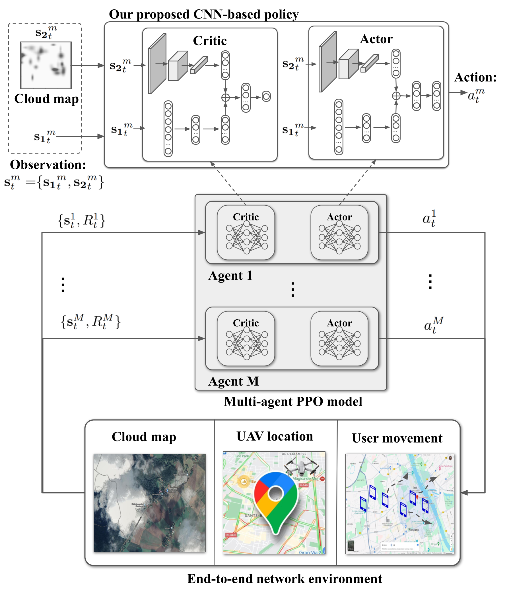

## Multi-Agent Deep Reinforcement Learning for UAV Placement in Optical IRS-Aided Aerial Networks

  

### Train our proposed CP-PPO MADRL model🤖
We can try with different IRS size as follows
~~~
py train.py --L 0.4 
~~~
### Test model🌗
~~~
py test.py 
~~~

  

